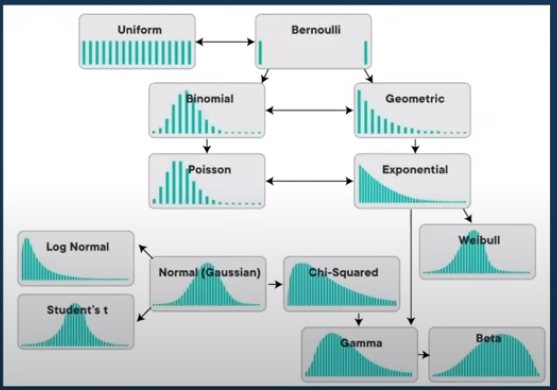
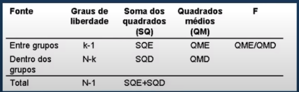
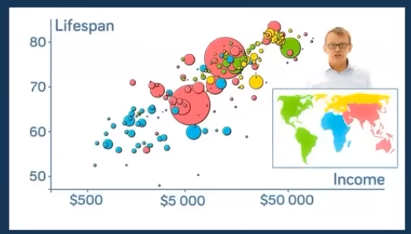

# **Semana da Estatística aplicada**

### _Professora Fernanda Maciel_

---

#### **that's why**

---

### Tópicos essências da EA:

## **Estatística Descritiva**
_(Base de análises)_

- namore os dados;
- variáveis descretas/contínuas;
- escalas de medidas (tipos de variáveis);
- visualização (maneira de mostrar os dados);
- medidas de tendência central (moda, mediana, média);
- distribuição (histograma/ bloxspot);
- medidas de dispersão (amplitude, variância, desvio padrão);
- covariância e **correlação**
---

### **Probabilidade** 

- probabilidade vs. estatística;
- espaço amostral;
- evento;
- união / interseção;
- propriedades da probabilidade;
- regras da probabilidade;
- probabilidade condicional;

---

### **Distribuições** 

- discreta / contínua;
- uniforme;
- binomial;
- poisson;
- normal (clássica);

---

## **Inferência estatística**
_(p/ trabalhar com amostras, com seleção de dados)_

- população vs. amostra;
- parâmetro vs. estatística;
- distribuição amostral;
- teorema central do limite;

- intervalo de confiança;
- margem de erro;
- **teste de hipóteses**;
- p-valor;
- tipos de erro;
---

### **Teste t**
_(para uma ou duas amostras)_

- comparação de médias;
- para uma amostra;
- para duas amostras (independentes ou pareadas);
  - Ex: peso de um grupo de pessoas antes/depois de uma diêta;
  - Ex: nota de um grupo de pessoas antes/depois de um treinamento;
---

### **ANOVA** 
_(para mais de duas amostras)_ 

- ANOVA de 1 via;
- ANOVA de 2 vias;
- teste post-hoc;
- com interação;
---

## **Modelagem estatística**

### **Regressão** 
_(linear - previsão || logística - classificação)_

- regressão simples;
- regressão multipla;
- análise de resíduos (pressupostos);
- R² e R² ajustado;
- suposições p/ verificar;
- variáveis categóricas;
- usar inferência na regressão;
- regressão logística;
- interpretação - tradução (estatíquês para português/inglês);
---